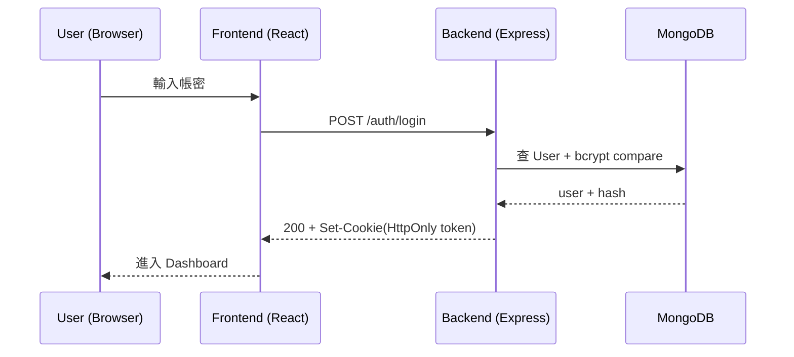

# 期末專案資安規格書（簡易可落地版）

> 目標：符合評分依據 **5 個後端安全設計、3 個前端安全設計、2 個其他可優化設計/規劃**，並包含加分項目（CI/CD 靜態分析、權限示範、Docker 部署）。


---

## 1. 專案概述

### 1.1 專案目的
建立一個具備登入/註冊與基本 CRUD 功能的 Web 系統，並以「可展示、可評分、可維護」為核心，完成必要的資安設計與專案管理流程。

### 1.2 技術棧（依你的要求）
- **前端**：React + Vite  
  - 語言：**TypeScript 工具鏈**（型別檢查）  
  - 檔案：React 元件 
  - 說明：  
    - React 元件用 `.jsx`（可搭配 JSDoc 註解 + `checkJs` 做型別檢查）  
    - 非元件/共用工具允許用 `.ts`（例如 `src/lib/*.ts`）  
- **後端**：Node.js + Express
- **資料庫**：MongoDB（Docker 啟動）
- **部署**：Dockerfile + docker-compose
- **CI/CD（加分）**：GitHub Actions + 靜態分析（ESLint / npm audit / CodeQL）

---

## 2. 系統角色與權限（加分：影片示範）

### 2.1 角色定義
- **guest（訪客）**：不登入也可使用「前端本地 CRUD」但不寫入後端
- **user（一般使用者）**：可對「自己建立的資料」CRUD
- **admin（管理者）**：可管理所有使用者資料（或所有資源），可查詢審計日誌（Audit Logs）

### 2.2 權限規則（後端必做）
| 行為 | guest | user | admin |
|---|---:|---:|---:|
| 瀏覽公開內容（若有） | ✅ | ✅ | ✅ |
| 建立資料（寫入 DB） | ❌ | ✅（自己的） | ✅（全部） |
| 修改資料 | ❌ | ✅（僅自己） | ✅ |
| 刪除資料 | ❌ | ✅（僅自己） | ✅ |
| 檢視 Audit Logs | ❌ | ❌ | ✅ |


---

## 3. 安全設計

## 3.1 前端安全設計（3 項）

### F1. 輸入驗證（格式/長度限制）
- 登入/註冊表單：帳號、密碼長度與格式限制
- CRUD 表單：欄位必填、最大長度、特殊字元限制（避免惡意 payload）
- 實作方式：
  - 表單送出前前端驗證
  - 後端回傳 400 時也要顯示通用錯誤（避免洩漏細節）

### F2. 密碼強度檢查（Strength Meter）
- 規則範例：
  - 長度 ≥ 8
  - 至少包含：英文大寫/小寫/數字（特殊字元可選）
- UI：
  - 顯示「弱/中/強」或條狀強度條
  - 提示使用者缺少哪些條件

### F3. 自動登出 / Token 過期處理（前端）
- 當 API 回傳 **401 / 403**（token 過期或無權限）：
  - 清除 localStorage（或記憶狀態）
  - 導回登入頁
  - 顯示「登入已過期，請重新登入」

---

## 3.2 後端安全設計（5 項）

### B1. 密碼雜湊與加鹽（bcrypt）
- 註冊：`bcrypt.hash(password, saltRounds)` 後存入 DB
- 登入：`bcrypt.compare(inputPassword, storedHash)`
- 禁止存明文密碼

### B2. JWT / Cookie 安全
- Access Token：
  - 有效期（例如 15~60 分鐘）
- 儲存方式（建議）：
  - **HttpOnly Cookie**（避免被 JS 讀取）
  - cookie 設定：
    - `HttpOnly: true`
    - `Secure: true`（上 HTTPS 才開）
    - `SameSite: Lax`（或依情境調整）
- 登出：
  - 清除 cookie / 使 token 失效（簡化可用清 cookie）

### B3. 權限控制（RBAC + 資源擁有者檢查）
- RBAC：判斷 `req.user.role`（user/admin）
- Ownership：資源資料需存 `ownerId`
  - user：只能 CRUD `ownerId == req.user.id` 的資料
  - admin：可 CRUD 全部

### B4. Rate Limiting（全站 API + 登入更嚴格）
- 全站 API：避免濫用
- login/register：避免暴力嘗試
- 回應：429 Too Many Requests

### B5. 安全日誌（Audit Log）
- 記錄事件：
  - 登入成功 / 登入失敗
  - 權限拒絕（403）
  - 重要 CRUD（尤其刪除）
- 建議欄位：
  - `timestamp, action, actorId, actorRole, ip, userAgent, resourceType, resourceId, result`

---

## 3.3 其他可優化設計/規劃（2 項）

### O1. 備份計畫 + 災難復原（DR）
- 備份頻率：每日/每週（擇一）
- 備份內容：
  - MongoDB 資料（mongodump 或 docker volume snapshot）
  - `.env` 不備份到 repo（敏感資訊）
- 還原流程：
  - mongorestore 或 volume 還原步驟
- 保留策略：保留最近 N 份（例如 7 份）

### O2. 日誌蒐集 + 告警規劃（簡版）
- 日誌來源：
  - API audit logs
  - Server error logs
- 告警規則範例（規劃即可）：
  - 同一 IP 在 10 分鐘內登入失敗超過 X 次 → 通知
- 告警方式（擇一）：
  - Email / Discord Webhook / Slack Webhook

---

## 4. 系統架構與資料夾規劃（評分重點：架構好看）

## 4.1 專案根目錄
```
project-root/
├── frontend/                 # React + Vite（JSX）
├── backend/                  # Express API
├── docker-compose.yml         # 一鍵啟動前後端 + MongoDB（加分）
├── .github/workflows/         # CI/CD（加分）
├── docs/                      # 規格書、圖片、流程圖
└── README.md
```

## 4.2 前端資料夾（React + Vite）
> 目標：**清楚分層（pages/components/api/lib）**，程式好維護。

```
frontend/
├── src/
│   ├── api/                  # 封裝後端 API 呼叫（fetch/axios）
│   │   ├── auth.js
│   │   └── items.js
│   ├── components/           # 可重用元件
│   │   ├── PasswordStrength.jsx
│   │   └── ProtectedRoute.jsx
│   ├── pages/                # 頁面層
│   │   ├── Login.jsx
│   │   ├── Register.jsx
│   │   └── Dashboard.jsx
│   ├── lib/                  # 共用工具（可用 .ts）
│   │   ├── validators.ts     # 表單驗證規則
│   │   └── authStorage.ts    # token/cookie 輔助（如需要）
│   ├── hooks/
│   │   └── useAuth.jsx
│   ├── styles/
│   │   └── main.css
│   ├── main.jsx
│   └── App.jsx
├── index.html
├── vite.config.js
├── package.json
└── tsconfig.json            # 仍可用於 type-check（checkJs）
```

### 4.2.1 TypeScript 但不使用 `.tsx` 的做法（文件化）
- React 元件：`.jsx`
- 型別檢查：
  - `tsconfig.json` 啟用 `checkJs: true`
  - 搭配 JSDoc：`/** @type {import('...').Type} */`
- 共用工具：允許 `.ts`（例如 validators, types, constants）

---

## 4.3 後端資料夾（Express + MongoDB）
> 目標：Route / Controller / Service / Model / Middleware 分層。

```
backend/
├── src/
│   ├── app.js                # express app 設定
│   ├── server.js             # 啟動入口
│   ├── config/
│   │   ├── env.js            # 讀取環境變數（避免硬編碼）
│   │   └── db.js             # Mongo 連線
│   ├── models/
│   │   ├── User.js
│   │   ├── Item.js
│   │   └── AuditLog.js
│   ├── routes/
│   │   ├── auth.routes.js
│   │   ├── items.routes.js
│   │   └── admin.routes.js
│   ├── controllers/
│   │   ├── auth.controller.js
│   │   ├── items.controller.js
│   │   └── admin.controller.js
│   ├── services/
│   │   ├── auth.service.js
│   │   ├── token.service.js
│   │   └── audit.service.js
│   ├── middleware/
│   │   ├── auth.js           # JWT 驗證
│   │   ├── rbac.js           # 角色權限
│   │   ├── ownership.js      # 資源擁有者檢查
│   │   ├── rateLimit.js      # API/login limiter
│   │   └── validate.js       # 請求內容驗證
│   ├── utils/
│   │   ├── password.js       # bcrypt + strength 規則（後端）
│   │   └── sanitize.js       # 白名單欄位 / 防 NoSQL injection 基本防護
│   └── errors/
│       ├── httpError.js
│       └── errorHandler.js
├── package.json
├── Dockerfile
└── .env.example
```

---

## 5. 資料模型（MongoDB / Mongoose）

### 5.1 User
- `username`：String（unique, required）
- `passwordHash`：String（required）
- `role`：String（enum: user/admin）
- `createdAt`：Date

### 5.2 Item（CRUD 資源範例）
- `title`：String（required, max length）
- `content`：String（optional, max length）
- `ownerId`：ObjectId（ref User）
- `createdAt`：Date
- `updatedAt`：Date

### 5.3 AuditLog
- `timestamp`：Date
- `action`：String（LOGIN_FAIL / LOGIN_OK / ITEM_DELETE / PERMISSION_DENY …）
- `actorId`：ObjectId（ref User, nullable for guest）
- `actorRole`：String
- `ip`：String
- `userAgent`：String
- `resourceType`：String
- `resourceId`：ObjectId/String
- `result`：String（OK / FAIL）

---

## 6. API 規格（後端）

### 6.1 Auth
- `POST /api/auth/register`
  - body：`{ username, password }`
  - 規則：密碼強度檢查、bcrypt 雜湊
- `POST /api/auth/login`
  - body：`{ username, password }`
  - 成功：Set-Cookie（HttpOnly token）
  - 失敗：**統一錯誤訊息**（避免帳號存在與否）
  - 套用 login rate limiter
- `POST /api/auth/logout`
  - 清除 cookie

### 6.2 Items（需登入）
- `GET /api/items`：列出自己的 items（admin 可看全部或加 query）
- `POST /api/items`：建立（ownerId = req.user.id）
- `PUT /api/items/:id`：修改（ownership）
- `DELETE /api/items/:id`：刪除（ownership）
- 所有敏感操作要寫 AuditLog

### 6.3 Admin（需 admin）
- `GET /api/admin/audit-logs`
  - 只允許 admin
  - 支援基本查詢：時間範圍、action 類型

---

## 7. 主要流程

### 7.1 登入流程（JWT Cookie）


### 7.2 權限拒絕示範
```mermaid
flowchart TD
  A[userA 嘗試刪除 itemB] --> B{token 驗證}
  B -->|通過| C{ownership 檢查}
  C -->|不是 owner| D[回 403 + 寫 AuditLog(PERMISSION_DENY)]
  C -->|是 owner| E[刪除成功 200 + 寫 AuditLog(ITEM_DELETE)]
```

---

## 8. CI/CD規劃：靜態分析為主

### 8.1 GitHub Actions 工作流程
- 觸發：push / pull_request
- 工作：
  - `npm ci`
  - `npm run lint`（ESLint）
  - `npm audit --audit-level=high`
  - CodeQL（JS/TS）掃描（加分）

> 文件化即可：你可以在 README 或 docs 寫「pipeline 會擋掉明顯風險」。

---

## 9. Docker快速部署

### 9.1 docker-compose（建議服務）
- `mongo`：MongoDB（volume 持久化）
- `backend`：Express API（連 mongo）
- `frontend`：Vite build 後用 nginx 或 node serve（擇一）

### 9.2 環境變數（避免硬編碼）
- `MONGO_URI`
- `JWT_SECRET`
- `COOKIE_SECURE`（dev 可 false、prod true）
- `RATE_LIMIT_*`

---

## 10. 測試計畫（Postman + Demo）

### 10.1 測試清單（必要）
- 註冊成功 / 密碼弱被拒絕
- 登入成功 / 錯誤帳密回通用訊息
- Rate limiting：短時間多次登入 → 429
- 權限：
  - userA 刪 userB 的 item → 403
  - admin 刪 userB 的 item → 200
- Audit logs：
  - 登入失敗與權限拒絕有記錄

---

## 11. 專案管理（評分加分點）
- 分支策略：`main`（穩定）/ `dev`（整合）/ `feature/*`
- commit message：動詞開頭 + 模組名  
  - 例：`feat(auth): add login rate limiter`  
  - 例：`fix(items): enforce ownership check`

---

## 12. 交付物清單
- 前端/後端原始碼（模組化、分層清楚）
- docs（本規格書、流程圖、架構圖/mermaid）
- Dockerfile / docker-compose（加分）
- GitHub Actions CI/CD（加分）
- 專案影片：
  - 不同身分權限示範（加分）
  - 重要資安功能展示（rate limit / audit log / token expiry）

---

# 附錄 A：建議的 docs/ 目錄
```
docs/
├── spec.md                # 本文件（可命名為 security-spec.md）
├── architecture.md        # 架構說明（可用 mermaid）
└── demo-script.md         # 影片腳本（建議）
```
